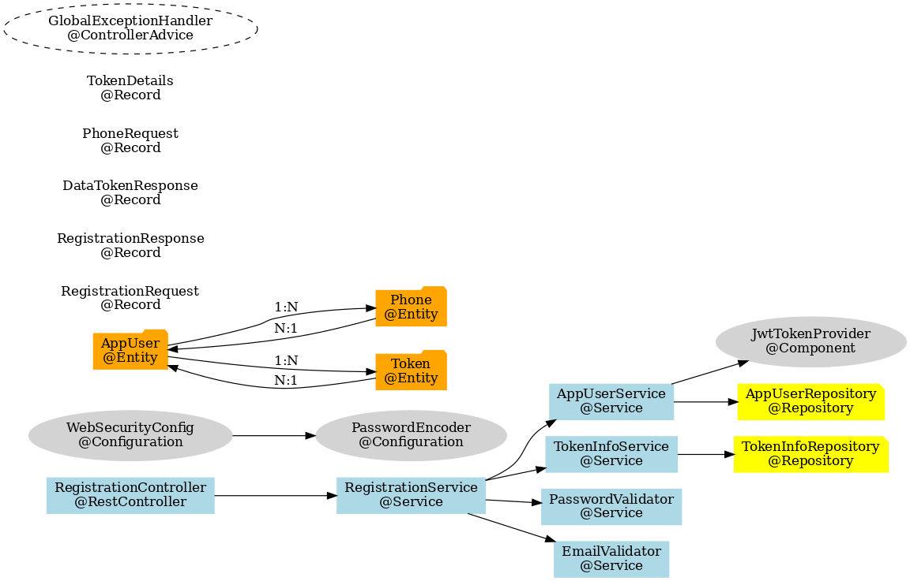
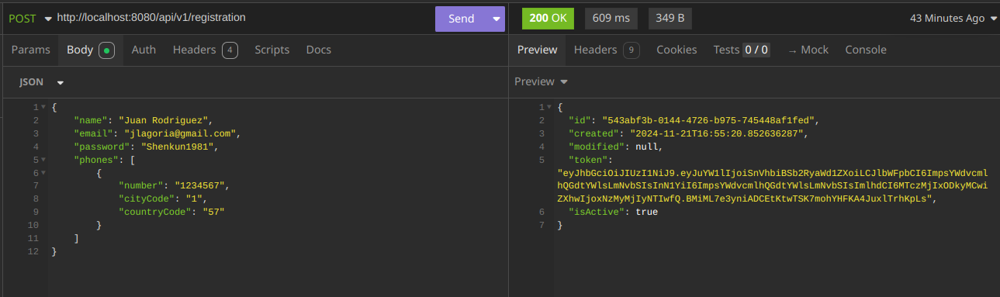

# API Registration

API Registration es un proyecto basado en Java 17 y Spring Boot diseñado para manejar el registro de usuarios y la autenticación. Este proyecto utiliza varias dependencias clave para facilitar la seguridad, la documentación de la API, y el almacenamiento de datos.

## Tabla de Contenidos

- [Requisitos](#requisitos)
- [Tecnologías Usadas](#tecnologías-usadas)
- [Configuración](#configuración)
- [Construcción y Ejecución](#construcción-y-ejecución)
- [API Documentation](#api-documentation)
- [Testing](#testing)

---

## Requisitos

- **Java**: 17 o superior
- **Maven**: 3.8 o superior

---

## Tecnologías Usadas

- **Spring Boot**:
    - `spring-boot-starter-data-jpa`: Manejo de bases de datos usando JPA.
    - `spring-boot-starter-security`: Seguridad y autenticación.
    - `spring-boot-starter-web`: Construcción de aplicaciones web REST.
- **SpringDoc**:
    - `springdoc-openapi-starter-webmvc-ui`: Generación automática de documentación OpenAPI.
- **Base de Datos**:
    - `H2 Database`: Base de datos en memoria para desarrollo y pruebas.
- **JSON Web Tokens**:
    - `jjwt-api`, `jjwt-impl`, `jjwt-jackson`: Manejo de autenticación basada en JWT.
- **Desarrollo y Pruebas**:
    - `spring-boot-devtools`: Recarga automática durante el desarrollo.
    - `lombok`: Reducción del código boilerplate.
    - `spring-boot-starter-test`: Herramientas de prueba para Spring Boot.
    - `spring-security-test`: Pruebas de funcionalidades relacionadas con seguridad.

---

## Configuración

1. **Clonar el repositorio:**
   ```bash
   git clone https://github.com/jclagoria/registration-user-api.git
   cd registration-user-api
   ```
   
2. **Archivos que se deben modificar**
Antes de inicial el projecto o realizar un deppliege se debe tener en cuenta alguno puntos necesarios para que 
el sistema pueda funcionar de manera correcta.
   - Se implemento el manejo de Profiles, por defecto se encuentra activado el profile DEV, esto esta de manera
   explicita en el archivo application.yml.
   
   - Si no se desea cambiar el profile se debe modificar el archivo application-dev.yml, registrado la siguiente
   informacion:
   ```yaml
    datasource:
        url: jdbc:h2:mem:gadget-db;DB_CLOSE_DELAY=-1;DB_CLOSE_ON_EXIT=FALSE
        username: adminCart
        password: 123456789
    jpa:
      show-sql: true
      hibernate:
        ddl-auto: create-drop
      properties:
        hibernate:
        dialect: org.hibernate.dialect.H2Dialect
   ```
    Sin estos datos la applicacion no funcionara de manera correcta.

## Construcción y Ejecución
Despues de clonar el repositorio y realizar las modificaciones al archivo YAML que se corresponda con el Profile
con el que se desee trabajar, se deben seguir los siguiemtes pasos.

1. **Instalar dependencias**
    ```bash
    mvn clean package
    ```
2. **Ejecutar la aplicación**
    ```bash
    mvn spring-boot:run
    ```
    
## Documentación de la Api 
La documentación de la API se genera automáticamente usando SpringDoc OpenAPI y está disponible en: http://localhost:8080/swagger-ui/index.html

## Testing
Para ejecutar las pruebas unitarias y de integración, utiliza:
    ```bash
    mvn test
    ```


## Diagram



## Example requests
### Insomnia



